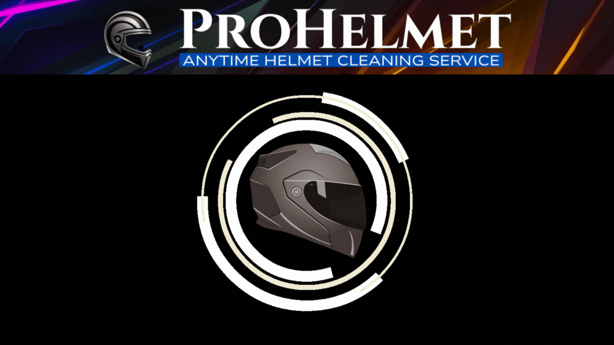

<html lang="en">
<head>
  <meta charset="utf-8" />
  <title>ProHelmet — Smart Helmet Cleaning Kiosk</title>
  <meta name="viewport" content="width=device-width, initial-scale=1" />
  
</head>
<body>

  

    <!-- Top banner -->
    <header>
      
    </header>
  

  <!-- In-page navigation -->
  <nav class="nav" aria-label="Sections">
    

      <a href="#about">About ProHelmet</a>|
      <a href="#pricing">Pricing</a>|
      <a href="#privacy">Privacy Policy</a>|
      <a href="#terms">Terms</a>|
      <a href="#refunds">Refunds</a>|
      <a href="#contact">Contact</a>
    

  </nav>

  

    <!-- About -->
    <section id="about">
      <h2>About ProHelmet</h2>
      
Your helmet protects you every day – but keeping it clean, fresh, and germ-free is often a hassle. ProHelmet makes it effortless.

      
A dirty helmet isn’t just uncomfortable – it can cause bad odor, skin irritation, dandruff, hair fall, and even bacterial growth that affects your health. ProHelmet takes away these worries by giving your helmet a hygienic deep clean in just a few minutes.

      
No mess, no waiting, no complicated steps – simply place your helmet in, let the machine do its work, and enjoy a helmet that feels as good as new.

      
Because cleanliness is not OCD, “Cleanliness is Godliness.”

      
ProHelmet isn’t just about cleaning – it’s about confidence, hygiene, and care for something you use every single day.

    </section>

    <!-- Pricing -->
    <section id="pricing">
      <h2>Pricing</h2>
      
Keeping your helmet fresh and germ-free doesn’t have to be expensive. ProHelmet offers a professional deep clean at a very low cost – so anyone can afford to ride with confidence.

      
We recommend giving your helmet a clean once every 15 days to maintain hygiene, freshness, and comfort.

      
For business owners who wish to set up a ProHelmet Kiosk and offer this service to riders, please call us at <strong>9849080443</strong> for a customized quote.

    </section>

    <!-- Privacy -->
    <section id="privacy">
      <h2>Privacy Policy</h2>
      <ul>
        <li>We don’t collect personal information unless you share it with us (e.g., contact or payment).</li>
        <li>Any info you provide is used only to serve you better—processing payments or replying to messages.</li>
        <li>We don’t sell, rent, or share your information with third parties.</li>
        <li>Payments are processed securely by trusted partners such as Razorpay. We do not store your card or bank details.</li>
        <li>Our site may use basic cookies or logs to improve your experience. We do not track sensitive personal data.</li>
        <li>By using ProHelmet, you agree to this privacy policy.</li>
        <li>Questions? Call <strong>9849080443</strong> or email <strong>prohelmet.protoptye@gmail.com</strong>.</li>
      </ul>
    </section>

    <!-- Terms -->
    <section id="terms">
      <h2>Terms &amp; Conditions</h2>

      <h3>Service Use</h3>
      <ul>
        <li>ProHelmet sanitizes and refreshes helmets.</li>
        <li>It is not intended to remove existing stains, scratches, or marks.</li>
        <li>For best upkeep, please wipe your helmet daily between sanitizing cycles.</li>
      </ul>

      <h3>Automation &amp; Connectivity</h3>
      <ul>
        <li>The machine is

